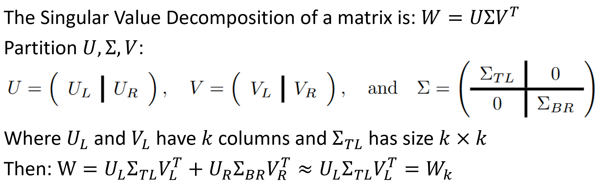
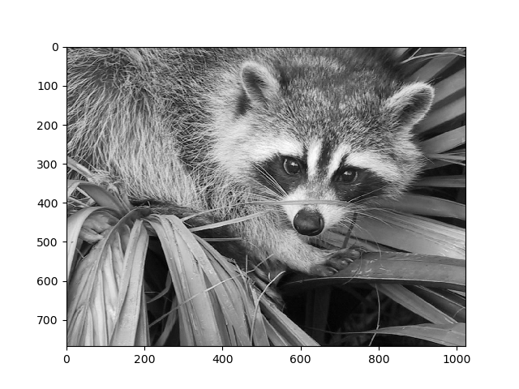
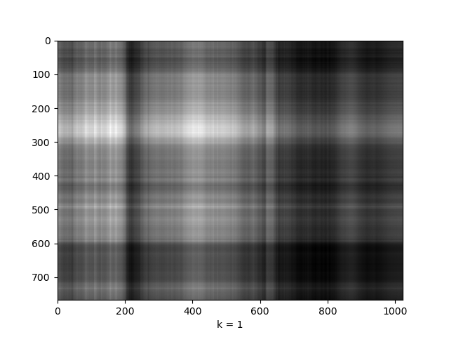
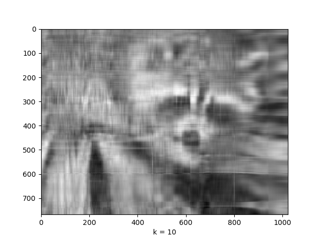

# Best Rank k

Basic math:

To read more about this, see the [wikipedia article for singular value decomposition](https://en.wikipedia.org/wiki/Singular_value_decomposition) and [these](https://www.cs.utexas.edu/users/flame/Notes/NotesOnRankKApprox.pdf) notes on the best-rank approximation. 

Then, if we take our input matrix W, here the image of the racoon from [scipy](https://docs.scipy.org/doc/scipy-0.16.0/reference/generated/scipy.misc.face.html#scipy.misc.face):

We can construct approximations to it, for example:

Note that for any value of k, the approximation has size N\*k + k\*k + k\*M (prior to the dot product reconstruction) for an input matrix of size NxM

Code to generate these images can be found in [rank_k.py](rank_k.py)